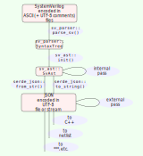

Purpose and Overview of `sv-ast`
================================

[Sv-parser](https://github.com/dalance/sv-parser)'s topmost structure
`SyntaxTree` provides an efficient iterator with a minimal memory footprint.
It is well suited to fast, reactive applications written in Rust which need to
perform simple syntactic analysis on SystemVerilog source code, knowing that
the syntax complies with the Backus-Naur Form specification in Annex A of
IEEE 1800-2017.
It is ideal for [svlint](https://github.com/dalance/svlint) and
[svls](https://github.com/dalance/svls) which facilitate short debug loops and
tight integration to text editors and fast continuous integration flows.
The parsability property is particularly useful for assessing code quality:
*if sv-parser cannot successfully parse text X, then X does not conform to the
formally specified grammar of SystemVerilog*.
That is, informally, if a file `X` doesn't work with sv-parser, then it's
highly likely that some tools will have issues working with `X`, perhaps
despite other tools not reporting any issues.

The purpose of this crate is different.
The purpose of this crate is to provide a data structure which can be
serialized, and robustly deserialized, to work nicely with other tools
including other programming langages.
[JSON](https://www.json.org/json-en.html) is chosen as the serialization format
due to its ubiquity, interoperability, and simple grammar.
That is, there are many JSON implementations available for all sorts of
programming languages, and those have (or can have) minimal CPU and memory
requirements.

By providing JSON access to the data of SystemVerilog sources, semantic
analysis can be applied step-by-step, using whatever tools are best suited to
the task.
The following diagram shows analysis by either an "internal pass" (modifying a
native Rust structure of type `SvAst`), or an "external pass" (modifying a JSON
document that can be deserialized back into an `SvAst` structure).

Internal passes are Rust functions belonging to this crate with a signature
like `fn foo (ast: &SvAst) -> Result<&SvAst, String>`.
External passes can be implemented in many ways, perhaps using simple text
utilities like
[`sed`](https://pubs.opengroup.org/onlinepubs/9699919799/utilities/sed.html)
and
[`awk`](https://github.com/step-/JSON.awk/),
JSON-specific utilities like
[`jq`](https://jqlang.github.io/jq/)
and
[`jaq`](https://github.com/01mf02/jaq),
or processors written in other languages.
JSON libraries are available for most popular languages, including
[Python](https://docs.python.org/3/library/json.html),
[Haskell](https://hackage.haskell.org/package/json),
and
[Rust](https://docs.rs/serde_json).

Organization
------------

This crate defines many data types.
Datatypes with the prefix `Sv` correspond directly to the parser's result, i.e.
the *concrete* syntax tree.
For example, `sv_ast::SvIntegerType` corresponds to `integer_type` in IEEE
1800-2017 A.2.2.1 (page 1146), and is (essentially) a serializable alternative
to `sv_parser::IntegerType`.
Datatypes without the prefix are abstractions which aim to be more useful.
For example, `sv_ast::IntegerType` (note the lack of `Sv` prefix) is an
abstract type with methods to find the maximum/minimum values of each subtype.
On initial creation, all nodes in the `SvAst` tree will have type names with
the `Sv` prefix.

